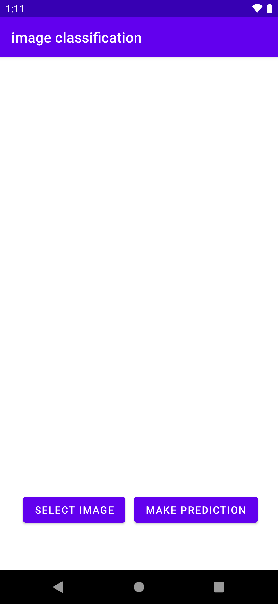
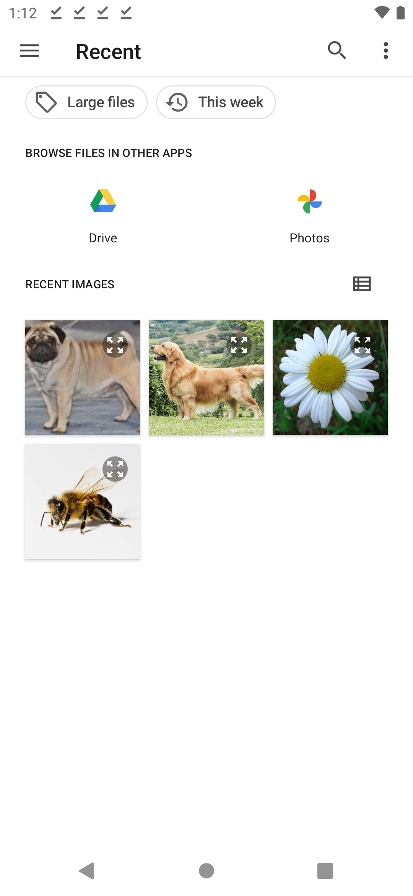
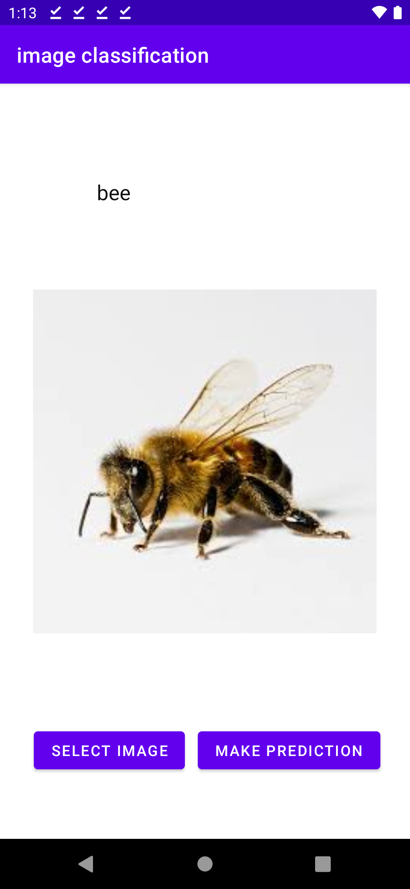
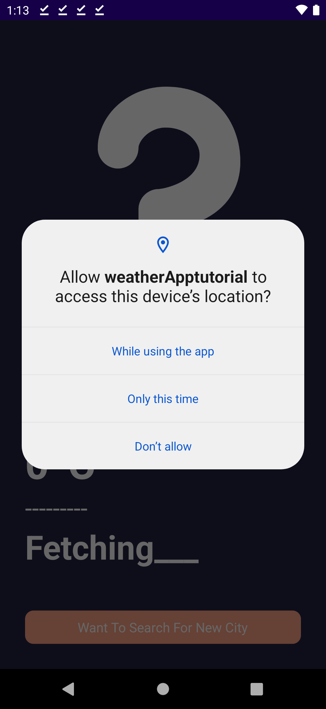
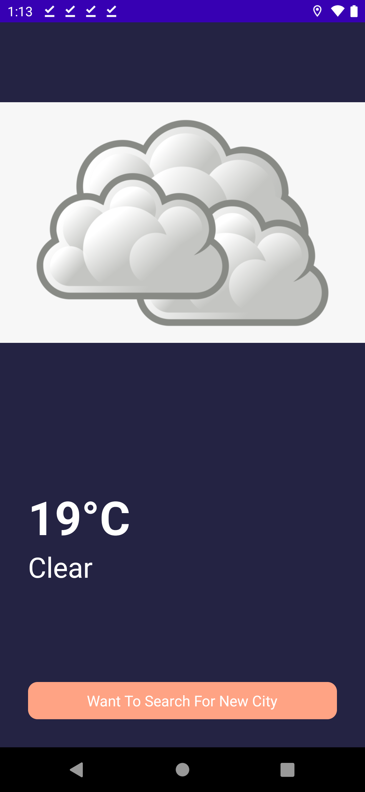

# Farming Scout
Farming scout is an Android application that can be used to identify different species of plants and animals in order for farmers to understand whether that organism could be a potential threat to their crops. 

With this identification, farmers can better understand the ecosystem around them and the impact it could have on their craft. In addition, a farming scout has a weather application integrated into it so farmers can use this information to decide whether they should harvest crops or start to germinate seeds. This weather application can fetch weather data based on the city or area they specify by using GPS coordinates.

[Here is a video demonstration of the web application in action.](https://www.youtube.com/watch?v=JXMV9xCFLQc)

## Our Inspiration
Many farmers today are unable to cope with the overwhelming surge of technology. In order to combat this, we've developed a user-friendly companion for farmers in order to help them with their craft and aid them in the path of embracing technology. Farming Scout's various uses and purposes make them the ideal companion for farmers.

## Application in Action
Below are screenshots of the Application while in use, highlighting it's easy to use interface and functionality.
|  Dashboard               |
:-------------------------:|
 |

### Image Classification

|  Image Classification    | Selecting Images          |  Example (Animal)         | Example (Flower)          | Example (Dog Breed) |
:-------------------------:|:-------------------------:|:-------------------------:|:-------------------------:|:----------------------:
 |  |  | |

### Weather App

|  GPS Permissions         | Location Weather          |  Custom City Weather      | Custom Weather Retrieved
:-------------------------:|:-------------------------:|:-------------------------:|:-------------------------:
 |  |  | 

## Dependencies
- Android Studio
- Java
- Kotlin
- Open Weather Data API
- Firebase
- Google Geocoding
- Python
- Tensorflow

## Authors
- Pratham Inamdar
- Aayush Srivastava
- Nihalraj Nooney
